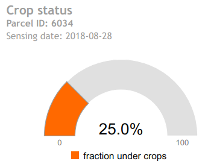
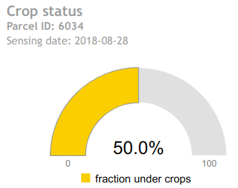
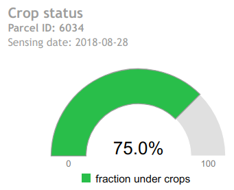
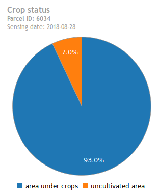
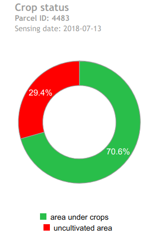

# gc-cropstatus widget
## Description
gc-cropstatus is an embeddable JavaScript/HTML widget for visualizing the outputs of the ag|knowledge REST API from [geocledian](https://www.geocledian.com).
It is built as a reusable [Vue.js](https://www.vuejs.org) component which allows the integration in [Vue.js](https://www.vuejs.org) applications smoothly. 
You may but you don't have to build the rest of the container application with [Vue.js](https://www.vuejs.org).

## Purpose
With this widget you are able to visualize the crop status (relative area under crops) of a certain date and parcel from the REST API of ag|knowledge from geocledian.com.
> **Please note** that the widget contains a DEMO API Key and a DEMO parcel. If you want to visualize your data it has to be registered first in the REST API of ag|knowledge from geocledian.com. <br> Contact us for getting an API Key and registering your data.

The following modes are supported:
- gauge<br>




- pie<br>


- donut<br>


## Configuration
This widget is customizeable via HTML attributes and supports the setting of the following attributes.

### Basic options
- gc-apikey: API Key from geocledian, e.g. "39553fb7-7f6f-4945-9b84-a4c8745bdbec"; default: '39553fb7-7f6f-4945-9b84-a4c8745bdbec'
- gc-host: base host, e.g. "geocledian.com"; default: 'geocledian.com'
- gc-mode: choose from "gauge", "pie" or "donut"; see above for details; default: "gauge"
- gc-parcel-id: which parcel to query; default: -1
- gc-selected-date: date as simple ISO date string for checking the status of the field for a given date , e.g. '2020-03-01' or "$root.queryDate"; default: ""
- gc-language: initial locale language for translation, e.g. "en" for english; default: "en"
  
### UI options
- gc-available-options: limit the available options, e.g. "" for not title at all; default: "title,description,dateSelector,legend"
- gc-legend-position: sets the position of the legend of the chart: 'bottom', 'right' or 'inset'; default: 'bottom'
- gc-widget-collapsed: start the widget collapsed or not; default: "false"

### Advanced options
#### Proxy mode / URL options
- gc-proxy: string which defines an alternative URL for sending the requests made by the widget instead of gc-host, e.g. "someproxy.someserver.com/app"; default: undefined

> __Note__: in proxy mode both gc-host and gc-api-key attributes are ignored and will not be sent to the given gc-proxy URL! It is assumed, that the Proxy will add the key parameter to the URL and sends the modified URL to the agknowledge service.

- gc-api-base-url: string for changing the base API URL for the agknowledge service; default: "/agknow/api/v3"
- gc-api-secure: boolean for specifying if HTTPS or HTTP shall be used sending the requests made by the widget;  default: true
  
## Integration
For the integration of the widget you'll have to follow two steps.

You have to add some dependencies in the head tag of the container website.

```html
<html>
  <head>

    <!--GC cropstatus component begin -->

    <!-- loads also dependent css files via @import -->
    <link href="css/gc-cropstatus.css" rel="stylesheet">
    <!-- init script for components -->
    <script type="text/javascript" src="js/gc-cropstatus-init.js"></script> 
     
    <!--GC cropstatus component end -->
  </head>

```

Then you may create the widget(s) with custom HTML tags anywhere in the body section of the website. Make sure to use an unique identifier for each chart component (chartid).

>If you want to change the id of the parent div ("gc-app") you'll have to change this divs' id also in the init script `gc-chart-init.js`, method `initComponent()`.


```html
<div id="gc-app">
  <gc-cropstatus gc-widget-id="cropstatus1" 
            gc-apikey="39553fb7-7f6f-4945-9b84-a4c8745bdbec" 
            gc-host="geocledian.com" 
            gc-parcel-id="4483"
            gc-selected-date="2018-07-13"
            gc-mode="pie"></gc-cropstatus>

  <gc-cropstatus gc-widget-id="cropstatus2" 
          gc-apikey="39553fb7-7f6f-4945-9b84-a4c8745bdbec" 
          gc-host="geocledian.com" 
          gc-parcel-id="4483"
          gc-selected-date="2018-05-13"
          gc-mode="gauge"></gc-cropstatus>
</div>
```

## Support
Please contact [us](mailto:info@geocledian.com) from geocledian.com if you have troubles using the widget!

## Used Libraries
- [Vue.js](https://www.vuejs.org)
- [Vue I18n](https://kazupon.github.io/vue-i18n/)
- [c3.js](https://c3js.org/)
- [axios.js](https://cdnjs.cloudflare.com/ajax/libs/axios/0.19.2/axios.min.js)

## Legal: Terms of use from third party data providers
- You have to add the copyright information of the used data. At the time of writing the following text has to be visible for [Landsat](https://www.usgs.gov/information-policies-and-instructions/crediting-usgs) and [Sentinel](https://scihub.copernicus.eu/twiki/pub/SciHubWebPortal/TermsConditions/TC_Sentinel_Data_31072014.pdf) data:

```html
 contains Copernicus data 2020.
 U.S. Geological Service Landsat 8 used in compiling this information.
```

**geocledian is not responsible for illegal use of third party services.**
